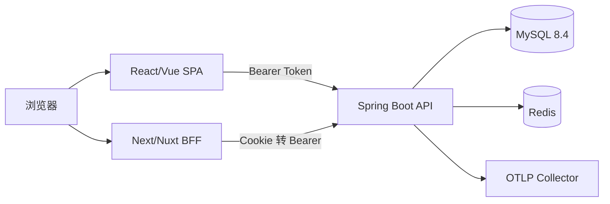

# 架构说明

## 总览



Spring Boot 4.1.1 模块化单体。代码按业务域组织，每个域内保留 api / application / domain / infrastructure 边界，后续可按负载拆分服务。

## 包结构与依赖方向

```
com.wl.cwa
├── auth             认证域：登录、Bearer 过滤器、Security 配置、SecurityFilterChain
│   ├── api          AuthController + LoginRequest/LoginResponse/CurrentUserResponse
│   ├── application  AuthService、TokenService、PasswordHashBenchmark、command
│   └── infrastructure.security  BearerTokenAuthenticationFilter、SecurityConfig
├── user             用户域：用户 CRUD、分页、bootstrap
│   ├── api          UserController + DTO（UserSummary/UserDetail/各请求体）
│   ├── application  UserAdministrationService、AdminBootstrap、command
│   └── domain       UserEntity、UserRoleEntity、UserRepository、UserSpecifications
├── authorization    权限域（叶子）：Role/Permission/关联实体与仓储、AuthorityQueryService
├── audit            审计域（叶子）：AuditEventEntity、AuditRecorder
└── shared           跨域基础设施
    ├── api          RequestIdFilter、RequestLogFilter、PageResponse、PageRequestFactory
    ├── config       CwaSecurityProperties、CwaBootstrapProperties、Clock
    ├── error        ErrorCode、BusinessException、RateLimitedException、ProblemDetailFactory、GlobalExceptionHandler
    └── security     SessionData、SessionStore、RedisSessionStore、LoginRateLimiter、TokenGenerator、Hashes、AuthenticatedUser
```

依赖规则（由 `ArchitectureTest` 强制）：

- `api` 只调用 `application`，不触碰 domain（例外：`AuthenticatedUser` principal 位于 shared）。
- `domain` 不依赖 Spring Web/Servlet/Redis。
- `authorization`、`audit` 是叶子域；`user` 不依赖 `auth`；`shared` 不依赖任何业务域。
- `@Transactional` 方法只出现在 application 层；禁止字段注入。

## 认证与会话

1. `POST /api/v1/login`：`LoginRateLimiter`（IP + 账号，Lua 原子计数）→ 查库 → `PasswordEncoder` 校验（未知用户用 dummy 哈希均衡时延）→ 加载角色/权限 → 生成 256-bit token → **数据库事务提交后**写 Redis 会话 → 审计 `LOGIN_SUCCESS/FAILURE`。
2. Redis 键：`cwa:session:{sha256(token)}`（会话 JSON，TTL=8h/30d）、`cwa:user-sessions:{userId}`（ZSET，按创建时间排序，上限 5 个，Lua 原子驱逐最旧）、`cwa:login-rate:{kind}:{sha256(subject)}:{bucket}`。
3. `BearerTokenAuthenticationFilter`：解析 Bearer → 摘要 → 读会话 → 构造 `AuthenticatedUser` principal。Redis 故障 → 503 `SESSION_STORE_UNAVAILABLE`（失败关闭）。
4. 权限敏感变更（改角色、禁用）撤销该用户全部会话。
5. `POST /api/v1/logout` 幂等：重复调用同 token 仍返回 204。

## 数据模型

六张表：`iam_user`、`iam_role`、`iam_permission`、`iam_user_role`、`iam_role_permission`、`audit_event`。全部结构来自 Flyway `V1__init_iam.sql`；JPA `ddl-auto=validate`。对外仅暴露 `BINARY(16)` UUID（`public_id`），自增主键不外泄。乐观锁列 `version` 支撑 PATCH/PUT 并发控制（409 `VERSION_CONFLICT`）。

## 错误模型

所有错误为 `application/problem+json`，顶层含 `type/title/status/detail/instance/code/msg/requestId/timestamp`，字段校验错误带 `errors[]`。错误码集中定义于 `ErrorCode`（`AUTH_INVALID_CREDENTIALS`、`VERSION_CONFLICT`、`RATE_LIMITED`、`SESSION_STORE_UNAVAILABLE`…）。`AccessDeniedException` 由 MVC 建议层转 403（`@PreAuthorize` 拒绝），匿名访问由 Security 入口点转 401。

## 可观测性

- 结构化 JSON 日志（Boot 内置 logstash 格式），MDC：`requestId/traceId/spanId/service/environment`；`RequestLogFilter` 输出 `event=http_access`，`pathTemplate` 永远是路由模板。
- 每个请求必有 `X-Request-ID`（合法入参回显，否则生成 UUID）。
- Micrometer：HTTP/JVM/连接池 + 自定义 `cwa.auth.login{result}`；Prometheus 暴露于管理端口。
- Micrometer Tracing（OTel bridge）+ OTLP 导出开关，默认关闭。

## 测试分层

| 层 | 示例 | 运行 |
| --- | --- | --- |
| 单元 | AuthService、限流器、ProblemDetail、PageRequestFactory、领域模型 | surefire |
| 切片 | @WebMvcTest（401/403/校验/契约形状）、@DataJpaTest（约束/乐观锁/投影） | surefire/failsafe |
| 集成 | AuthFlowIT、RedisDownIT、UserAdminIT、SchemaMigrationIT、AdminBootstrapIT（真实 MySQL/Redis 容器） | failsafe |
| 契约 | OpenApiContractIT：openapi.yaml 路径/字段与实际响应一致 | failsafe |
| 架构 | ArchitectureTest（ArchUnit 边界与循环依赖） | surefire |
